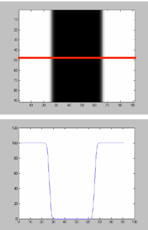
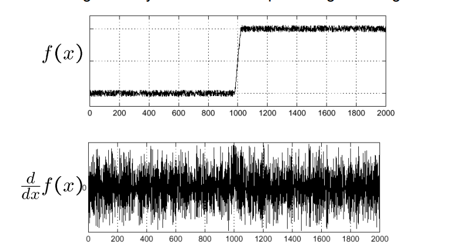

Readme

# Edge detection code
**Code by** Rushabh Nalin Mehta (MSc Roobotics Systems Engineering, RWTH Aachen University)
## How to use?
1. Installing required libraries run the following commond "pip install -r requirements.txt"      
2. After running the file in console enter the address to the image on which edge detection is needed and press enter.
3. Enter the location of the location in which you want to store the resulting image
4. Enter the files name and its type. for example "Result1.png" or "result3.jpg"
5. You will find the image at the location you had entered with the file name you had entered.

## How does it work?
1. The program reads the location of the image entered by the user and imports the file as a matrix with 3 channel i.e. RGB. The shape of the image is irrelevant. The values in the matrix are the values that range from 0 to 255 the data type used is "uint8"
2. What is a edge? 
->Edge is sudden change in colors and this particular fact can be used for detecting them. 

->Detecting sudden change can be done by differentials, in case of images it is change in RGB pixel values as we go in one direction. Before we get 
->But the differentials are prone to noise and hence we need to get rid of it, in the program we do it using the a gaussian filter with window size of 5 pixels and then go for the canny edge detector

->In Canny edge detector, due to smoothing we get the output which are broader than 1 pixel and hence non maximum supression is used. we then use hysteresis thresholding to get good edge detection.
3. After we get edges we change the pixels in the original image where the edges were detected to green.
## Libraries used
1) Language : Python
2) OpenCV
3) Numpy
## Future improvement
If we are targetting a certain type of edges ie circle or line then we can use Hough Transform.