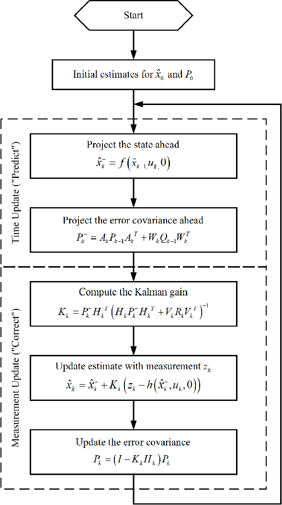

Readme

# Localization Problem

## Approch
#### EKF Kalman Filter

image 1: Flow chart of EKF
#### Hard coding the gain
- The approch is similar to EKF but the gain is hardcoded
- The robot estimate is the odometric data which is updated using the error from the sensor data.
## Implementation details
#### Extended Kalman Filter
- The initialization is done in myinit to global matrix using Eigen.
- Time update step is done in sensorUpdate()
- Motion update converts the local coordinate to the global coordinate system considering the odometric error.
- In the pose estimation we give the estimate location to the controller.
#### Hard coding the gain
- The initialization is done in myinit by global variables.
- Motion update converts the local coordinate to the global coordinate system.
- The error would be generated from the difference between the odometric values and that of the distance and bearing from the sensor.
- The final update of the location estimate is done as the odometric values and the error multiplied by hardcored gain.
## Key decisions
#### EKF Kalman Filter
- Selected EKF because it is well suited for the task and can take care of the errors from the sensors. EKF assumes noise in not gaussian and uses Jacobian instead to linearize at a point.
#### Hard coding the gain
- Selectinng the Kalman gain based on trial and error.
- Selecting the error equation.

## Improvements
### Improvement in solution
#### EKF Kalman Filter
- The code is writen with assumption that the location of the markers also have noise and this adds more complications to the calculations, I would like to eleminate this noise consideration,
#### Hard coding the gain
- The update eqation doesnt take into account the noise coming from sensor. I would like to include a code that will take care of it.
- Currently I am using a fixed gain but when there is a jump in the robots position due to disturbunces the localization code doesnt work. I will get to implimenting complete kalman filter, this include the Kalman gain to self regulate.
- I will add a triangulation subroutine to the code when two or more markers are observed resulting into greatly improving the localization in case of disturbances.
### Improvement in Task
- The make file can incule provision to debug.